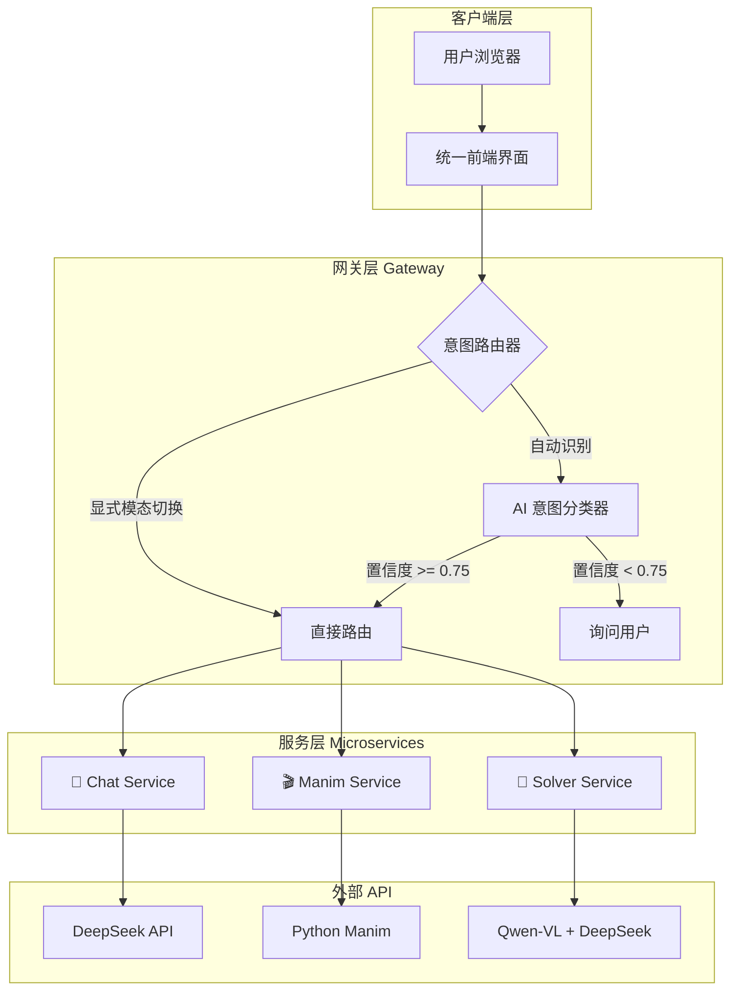

# 🍦 ICeCream - 统一智能平台实现计划

> **目标**：将 ICeCreamChat（对话D:\GitHub\ICeCream_Core）、MathSpace（动画可视化D:\GitHub\ICeCream_Core）、MathSolver（解题D:\GitHub\MathSolver）整合为一个统一入口的智能平台，通过 AI 意图识别 + 显式模态切换实现无缝路由。

---

## 📋 需要用户确认的事项

> [!IMPORTANT]
> **架构决策确认**  
> 以下决策需要您在开发前确认：
> 1. **技术栈选择**：统一使用 Node.js (Express) 作为 Gateway，保持与现有项目一致？
> 2. **意图识别模型**：使用 DeepSeek-Chat 作为意图分类器，还是使用更轻量级的方案？
> 3. **新项目位置**：在 `d:\GitHub\` 下创建新项目 `ICeCream`？

> [!CAUTION]
> **数据迁移提醒**  
> 整合后，现有的 `ICeCream_Core` 中的 `ICeCreamChat` 和 `MathSpace` 将被重新组织。请确保已备份或已推送至 GitHub。

---

## 🏗️ 系统架构



---

## 🎨 UI/UX 设计规范

> 基于 **ui-ux-pro-max** 技能 + **MathSolver 现有风格** 提炼

### 设计风格：Pro Max Glass (玻璃拟态 + 霓虹强调)

| 属性 | 规范值 | 说明 |
|------|--------|------|
| **风格** | Glassmorphism (Pro Max) | 极致玻璃质感 + 噪点纹理 |
| **强调色** | `#00f0ff` (Neon Cyan) | 霓虹青色，带发光效果 |
| **字体** | Inter + JetBrains Mono | 现代无衬线 + 等宽代码字体 |
| **圆角** | 24px 主容器 / 12-14px 按钮 | 圆润、柔和 |
| **模糊** | `blur(24px)` | 强背景模糊 |
| **动画** | 150-300ms, cubic-bezier | 丝滑过渡 |

---

### CSS 设计变量 (Design Tokens)

```css
:root {
    /* === 核心色板 (Pro Max Dark) === */
    --bg-base: #020617;              /* Slate 950 - 极深背景 */
    --text-primary: #f8fafc;         /* Slate 50 - 主文字 */
    --text-secondary: #94a3b8;       /* Slate 400 - 次要文字 */
    
    /* 霓虹青强调色 */
    --accent-color: #00f0ff;
    --accent-glow: 0 0 20px rgba(0, 240, 255, 0.5);
    
    /* 玻璃拟态 */
    --glass-panel: rgba(15, 23, 42, 0.45);
    --glass-border: rgba(255, 255, 255, 0.08);
    --glass-highlight: rgba(255, 255, 255, 0.15);
    --glass-blur: blur(24px);
    
    /* 气泡样式 */
    --bot-bubble: rgba(30, 41, 59, 0.5);
    --user-bubble: linear-gradient(135deg, #0061ff 0%, #60efff 100%);
    
    /* 深度阴影 */
    --shadow-depth: 
        0 4px 6px -1px rgba(0, 0, 0, 0.1),
        0 2px 4px -1px rgba(0, 0, 0, 0.06),
        0 20px 50px -12px rgba(0, 0, 0, 0.5);
    
    /* 噪点纹理 */
    --glass-noise-pattern: url("data:image/svg+xml,...");
}

/* === 浅色模式 === */
body.light-mode {
    --bg-base: #f0f4f8;
    --text-primary: #1e293b;
    --text-secondary: #64748b;
    --accent-color: #0ea5e9;
    --glass-panel: rgba(255, 255, 255, 0.6);
    --glass-border: rgba(255, 255, 255, 0.6);
    --bot-bubble: rgba(255, 255, 255, 0.7);
    --shadow-depth: 0 20px 50px -12px rgba(0, 0, 0, 0.1);
}
```

---

### 核心组件规范

#### 1. 主容器 (App Layout)
```css
.app-layout {
    max-width: 1600px;
    background: var(--glass-panel);
    border: 1px solid var(--glass-border);
    border-top: 1px solid var(--glass-highlight);  /* 顶部高光 */
    border-radius: 24px;
    box-shadow: var(--shadow-depth), inset 0 0 0 1px rgba(255, 255, 255, 0.05);
    backdrop-filter: var(--glass-blur);
    overflow: hidden;
}
```

#### 2. 按钮样式
```css
.btn-primary {
    background: linear-gradient(135deg, 
        rgba(0, 240, 255, 0.12) 0%, 
        rgba(0, 97, 255, 0.08) 100%);
    border: 1px solid rgba(0, 240, 255, 0.3);
    border-radius: 14px;
    color: var(--accent-color);
    transition: all 0.2s ease;
}

.btn-primary:hover {
    transform: translateY(-1px);
    box-shadow: var(--accent-glow);
}
```

#### 3. 输入框
```css
.input-container {
    background: rgba(0, 0, 0, 0.2);
    border: 1px solid var(--glass-border);
    border-radius: 24px;
    box-shadow: inset 0 2px 4px rgba(0, 0, 0, 0.1);
}

.input-container:focus-within {
    border-color: var(--accent-color);
    box-shadow: 0 0 0 2px rgba(0, 240, 255, 0.1);
}
```

#### 4. 模态切换器 (新增组件)
```css
.mode-switcher {
    display: flex;
    align-items: center;
    gap: 8px;
    background: rgba(0, 0, 0, 0.2);
    border: 1px solid var(--glass-border);
    border-radius: 12px;
    padding: 4px;
}

.mode-tab {
    padding: 8px 16px;
    border-radius: 8px;
    font-size: 14px;
    color: var(--text-secondary);
    cursor: pointer;
    transition: all 0.2s ease;
}

.mode-tab.active {
    background: var(--accent-color);
    color: var(--bg-base);
    box-shadow: var(--accent-glow);
}

.mode-tab:hover:not(.active) {
    background: rgba(255, 255, 255, 0.1);
    color: var(--text-primary);
}
```

#### 5. 意图确认弹窗
```css
.intent-confirm {
    background: var(--glass-panel);
    border: 1px solid var(--glass-border);
    border-radius: 16px;
    padding: 16px;
    backdrop-filter: var(--glass-blur);
    animation: fadeIn 0.3s ease;
}

.intent-options {
    display: flex;
    gap: 12px;
    margin-top: 12px;
}

.intent-option {
    flex: 1;
    padding: 12px;
    border-radius: 12px;
    text-align: center;
    cursor: pointer;
    border: 1px solid var(--glass-border);
    transition: all 0.2s ease;
}

.intent-option:hover {
    border-color: var(--accent-color);
    background: rgba(0, 240, 255, 0.08);
}
```

---

### UI 质量检查清单

参考 `ui-ux-pro-max` 技能的预交付检查：

- [ ] 无 emoji 作为图标（使用 Lucide SVG 图标）
- [ ] 所有可点击元素有 `cursor: pointer`
- [ ] 所有交互元素有 hover 状态反馈
- [ ] 过渡动画在 150-300ms
- [ ] 深色/浅色模式均通过对比度测试 (4.5:1)
- [ ] 浮动元素与边缘保持适当间距
- [ ] 无内容被固定导航栏遮挡
- [ ] 响应式测试：375px / 768px / 1024px / 1440px
- [ ] 尊重 `prefers-reduced-motion`

---

## 📁 项目结构设计

```
ICeCream/
├── gateway/                          # 统一入口 + 意图路由
│   ├── server.js                     # Express 主服务
│   ├── routes/
│   │   ├── chat.js                   # /api/chat 路由
│   │   ├── manim.js                  # /api/manim 路由
│   │   └── solver.js                 # /api/solver 路由
│   ├── middleware/
│   │   ├── intent-router.js          # 意图识别中间件
│   │   └── auth.js                   # 认证中间件 (可选)
│   └── services/
│       └── intent-classifier.js      # AI 意图分类器
│
├── services/
│   ├── chat/                         # 来自 ICeCreamChat
│   │   └── chat-handler.js
│   ├── manim/                        # 来自 MathSpace
│   │   ├── manim-client.js           # 调用 Python manim-service
│   │   └── code-executor.js
│   └── solver/                       # 来自 MathSolver
│       ├── vision-service.js
│       ├── diagram-service.js
│       └── reasoning-service.js
│
├── public/                           # 统一前端
│   ├── index.html
│   ├── css/
│   │   └── main.css                  # 遵循上述设计规范
│   └── js/
│       ├── app.js                    # 主入口
│       ├── chat-panel.js             # 对话面板模块
│       ├── mode-switcher.js          # 模态切换 UI
│       ├── intent-feedback.js        # 意图确认 UI
│       └── modules/
│           ├── math-renderer.js      # LaTeX 渲染 (KaTeX)
│           ├── video-player.js       # 动画播放
│           ├── image-uploader.js     # 图片上传
│           └── particle-engine.js    # 粒子背景效果
│
├── manim-service/                    # Python Manim 渲染服务 (复用)
│   ├── main.py
│   └── requirements.txt
│
├── .env.example
├── package.json
├── start.bat
└── README.md
```

---

## 🔌 意图识别系统设计

### 架构决策记录 (ADR-001): 意图识别策略

**Context（上下文）**
- 用户在统一入口发送消息，系统需判断意图后路由到对应服务
- 需平衡识别准确率、延迟和开发成本

**Options Considered（候选方案）**

| 方案 | 优点 | 缺点 | 复杂度 |
|------|------|------|:------:|
| 纯关键词匹配 | 零延迟、无 API 成本 | 无法处理模糊表达 | 低 |
| 纯 AI 分类器 | 智能、覆盖率高 | 增加延迟和成本 | 中 |
| **混合方案** | 兼顾速度和智能 | 需维护两套逻辑 | 中 |

**Decision（决策）**
采用 **"显式模态切换 + AI 意图分类器 + Soft Fallback"** 混合方案。

**Trade-offs Accepted（接受的权衡）**
- ✅ 用户显式切换时零延迟
- ✅ AI 分类器处理模糊情况
- ✅ 低置信度时询问用户，避免误判
- ⚠️ 需维护关键词规则 + AI Prompt 两套逻辑

---

### 意图分类器 Prompt 设计

```javascript
// gateway/services/intent-classifier.js

const INTENT_PROMPT = `
你是一个意图分类器。请根据用户消息判断其最可能的意图。

## 意图类型
1. **chat**: 普通闲聊、问答、知识咨询
2. **manim**: 想生成数学动画、可视化图形
3. **solver**: 想解题、求解数学问题、上传了题目图片

## 判断规则
- 包含"画"、"动画"、"可视化"、"演示" → 大概率 manim
- 包含"解题"、"求解"、"证明"、"计算" → 大概率 solver
- 上传了图片 → 大概率 solver
- 其他 → chat

## 输出格式
只返回一个 JSON：
{"intent": "chat|manim|solver", "confidence": 0.0~1.0}

---

用户消息："{USER_MESSAGE}"
是否上传图片：{HAS_IMAGE}
`.trim();
```

---

## 📦 实现计划

### 阶段 1：项目初始化与框架搭建
> 预计耗时：1-2 小时

#### [NEW] [package.json](file:///d:/GitHub/ICeCream/package.json)
- 初始化 npm 项目
- 添加依赖：`express`, `node-fetch`, `multer`, `dotenv`, `cors`, `sharp`

#### [NEW] [gateway/server.js](file:///d:/GitHub/ICeCream/gateway/server.js)
- 创建 Express 服务，监听端口 3000
- 配置静态文件服务
- 挂载 `/api/chat`, `/api/manim`, `/api/solver` 路由

#### [NEW] [.env.example](file:///d:/GitHub/ICeCream/.env.example)
- 定义环境变量模板：API Keys, 端口配置

---

### 阶段 2：意图识别中间件
> 预计耗时：2-3 小时

#### [NEW] [gateway/services/intent-classifier.js](file:///d:/GitHub/ICeCream/gateway/services/intent-classifier.js)
- 实现 `classifyIntent(message, hasImage)` 函数
- 调用 DeepSeek API 进行意图分类
- 返回 `{intent, confidence}` 对象

#### [NEW] [gateway/middleware/intent-router.js](file:///d:/GitHub/ICeCream/gateway/middleware/intent-router.js)
- 实现意图路由中间件
- 逻辑：
  1. 检查是否有显式模态切换 → 直接路由
  2. 检查是否有图片 → 路由到 solver
  3. 检查关键词 → 快速匹配
  4. 调用 AI 分类器 → 根据置信度决策

---

### 阶段 3：服务层迁移
> 预计耗时：3-4 小时

#### [NEW] [services/chat/chat-handler.js](file:///d:/GitHub/ICeCream/services/chat/chat-handler.js)
- 从 `ICeCream_Core/apps/icecream-chat` 迁移聊天服务逻辑
- 保持 DeepSeek API 集成

#### [NEW] [services/manim/manim-client.js](file:///d:/GitHub/ICeCream/services/manim/manim-client.js)
- 从 `ICeCream_Core/manim-service` 迁移调用逻辑
- 保持与 Python manim-service 的通信

#### [NEW] [services/solver/](file:///d:/GitHub/ICeCream/services/solver/)
- 从 `MathSolver/services/` 迁移：
  - `vision-service.js` (Qwen-VL 调用)
  - `diagram-service.js` (图表处理)
  - `reasoning-service.js` (DeepSeek 推理)

---

### 阶段 4：统一前端开发
> 预计耗时：4-5 小时

#### [NEW] [public/index.html](file:///d:/GitHub/ICeCream/public/index.html)
- 统一入口页面
- 包含对话面板、模态切换器、结果展示区
- 使用 Lucide 图标，无 emoji

#### [NEW] [public/css/main.css](file:///d:/GitHub/ICeCream/public/css/main.css)
- 遵循上述设计规范
- 实现深色/浅色双模式
- 包含：玻璃拟态容器、霓虹按钮、粒子背景

#### [NEW] [public/js/mode-switcher.js](file:///d:/GitHub/ICeCream/public/js/mode-switcher.js)
- 模态切换器 UI 组件
- 选项：自动识别、仅聊天、动画模式、解题模式

#### [NEW] [public/js/intent-feedback.js](file:///d:/GitHub/ICeCream/public/js/intent-feedback.js)
- 低置信度时的意图确认 UI
- 按钮组：[💬 聊一聊] [🎬 生成动画] [📐 解这道题]

#### [NEW] [public/js/modules/particle-engine.js](file:///d:/GitHub/ICeCream/public/js/modules/particle-engine.js)
- 从 MathSolver 迁移粒子背景引擎
- 数学符号飘动效果

---

### 阶段 5：Python Manim 服务集成
> 预计耗时：1 小时

#### [COPY] [manim-service/](file:///d:/GitHub/ICeCream/manim-service/)
- 从 `ICeCream_Core/manim-service/` 复制整个目录
- 无需修改，保持独立运行

---

### 阶段 6：测试与验收
> 预计耗时：2-3 小时

#### 自动化测试
- [ ] 测试显式模态切换：选择"解题模式"后发送文字，确认路由到 solver
- [ ] 测试图片上传：上传题目图片，确认自动路由到 solver
- [ ] 测试关键词匹配："画一个正弦函数" → 确认路由到 manim
- [ ] 测试 AI 分类器："帮我把这个公式变成视频" → 确认路由到 manim
- [ ] 测试低置信度回退："帮我" → 确认弹出确认 UI

#### 手动验证
- [ ] 完整对话流程：发送普通问题 → 收到 AI 回复
- [ ] 完整动画流程："画一个二次函数" → 看到渲染的视频
- [ ] 完整解题流程：上传几何题图片 → 收到解题步骤
- [ ] 深色/浅色模式切换正常
- [ ] 移动端响应式布局正确

---

## ⏱️ 时间估算

| 阶段 | 预计耗时 | 累计 |
|------|:--------:|:----:|
| 阶段 1：项目初始化 | 1-2 小时 | 2小时 |
| 阶段 2：意图识别 | 2-3 小时 | 5小时 |
| 阶段 3：服务迁移 | 3-4 小时 | 9小时 |
| 阶段 4：前端开发 | 4-5 小时 | 14小时 |
| 阶段 5：Manim 集成 | 1 小时 | 15小时 |
| 阶段 6：测试验收 | 2-3 小时 | **18小时** |

---

## 🔗 相关资源

- **现有代码库**：
  - [ICeCream_Core](file:///d:/GitHub/ICeCream_Core/) - 聊天和动画服务
  - [MathSolver](file:///d:/GitHub/MathSolver/) - 解题服务
- **使用的技能**：
  - `ui-ux-pro-max` - UI/UX 设计智能
  - `architecture` - 架构决策框架
  - `microservices-patterns` - 微服务通信模式
