# Smart Seating Planner - 实施计划 v2

## 核心架构: 解析 → 确认 → 执行

```mermaid
flowchart LR
    A[🟢 智能解析] --> B[🟡 可视化博弈]
    B --> C[🔴 排座计算]
    C --> D[📤 导出分享]
```



---

## 🔒 关键改进点

### 1. AI 数据一致性校验 (Critical)
```javascript
// 后端必须校验
const inputIds = students.map(s => s.id).sort();
const outputIds = layout.flat().filter(id => id).sort();
if (JSON.stringify(inputIds) !== JSON.stringify(outputIds)) {
    throw new Error("AI 结果不一致，自动重试...");
}
```

### 2. 真实教室布局支持
- **过道标记**: Grid 中支持 `_aisle_` 占位符
- **空座处理**: 奇数人数时用 `null` 填充
- **右键菜单**: 设为过道/空座

### 3. 智能名单导入
- **Excel 粘贴解析**: `张三\t男\t85` → 自动识别列
- **预览确认**: "识别到 45 人，请确认格式"

### 4. 导出功能
- **PNG 图片**: `html2canvas` 截图 → 发班级群
- **Excel 文件**: 纯文本座位表 → 教务存档

### 5. 约束状态可视化
- ✅ 满足 → 正常图标
- ⚠️ 未满足硬约束 → 红色闪烁
- 💔 未满足软约束 → 灰色空心

---

## 数据模型

```typescript
interface Student {
  id: string; name: string; gender: 'M'|'F';
  grade?: number; visionIssue?: boolean; height?: number;
}

interface Constraint {
  type: 'front_row'|'avoid'|'prefer'|'pair';
  target: string; related?: string;
  reason: string; priority: 'hard'|'soft';
}

interface ClassroomGrid {
  rows: number; cols: number;
  aisles: number[]; // 过道列索引
  layout: (string|null)[][]; // studentId 或 null
}
```

---

## AI Prompt (优化版)

```markdown
你是座位规划算法专家。

【任务】将 {{count}} 名学生填入 {{rows}}×{{cols}} 网格。

【规则】
1. 完整性: 输出必须恰好包含所有学生ID
2. 空座: 位置多于学生时用 null 填充
3. 优先级: 硬约束 > 避嫌 > 策略 > 心愿

【输出 JSON】
{
  "layout": [["s01","s02",null],["s03","s04","s05"]],
  "stats": {"total":45, "gender_mix":0.85},
  "unsatisfied": [{"target":"s05","reason":"前排已满"}]
}
```

---

## 前端布局

```
┌─────────────────────────────────────────────┐
│ 🪑 智能座位安排                    [← 返回] │
├───────────────┬─────────────────────────────┤
│ 📝 学生名单   │ 🏫 教室视图 (支持过道)     │
│ [粘贴/导入]   │ ┌──┬──┬ ┬──┬──┐            │
│ [预览确认]    │ │👓│💙│ │  │  │ (空格=过道) │
├───────────────┤ └──┴──┴ ┴──┴──┘            │
│ 📣 约束描述   ├─────────────────────────────┤
│ [解析约束]    │ 📊 约束状态                 │
├───────────────┤ ✅ 张三前排  ⚠️ 李四冲突   │
│ ⚙️ 策略开关   │ 💔 赵六心愿未满足          │
│ ☑ 男女搭配   └─────────────────────────────┤
│ ☑ 强弱互补   [🎯生成] [📸导出PNG] [📊导出Excel]│
└─────────────────────────────────────────────┘
```

---

## 文件清单

| 文件 | 说明 |
|------|------|
| `seating-planner.js` | 前端主模块 |
| `seating-planner.css` | 专用样式 |
| `tools.js` | 后端 API (parse/plan) |
